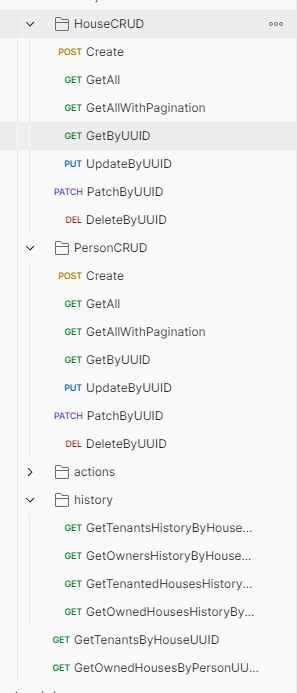

# :satellite: О проекте

Web приложение учёта домов и жильцов
Подключен SpringBoot
Подключен DataJPA
Реализован базовый функционал

## :gear: Как запустить проект:

```bash

0. Склонировать репозиторий себе на компьютер

1.Запускаем DemoApplication через SpringBoot

2.Скрипты запускаются автоматически через flywayMigration. 

3. Добавлен экспорт из Postman для работы с приложением
HousesProject.postman_collection.json
 

```



Task
Берём за основу существующее приложение и переезжаем на Spring boot 3.2.* в ветке feature/boot

Добавляем сущность HouseHistory (id, house_id, person_id, date, type)

1. type [OWNER, TENANT]
   a. Создать свой тип данных в БД
   b. Хранить как enum в коде
2. При смене места жительства добавляем запись в HouseHistory [type = TENANT], с текущей датой
3. При смене владельца, добавляем запись в HouseHistory [type = OWNER], с текущей датой
4.
    * Реализовать через триггер в БД
5.
    * Если используется миграция, дописать новый changeset, а не исправлять существующие.

Добавляем методы:

1. GET для получения всех Person когда-либо проживавших в доме
2. GET для получения всех Person когда-либо владевших домом
3. GET для получения всех House где проживал Person
4. GET для получения всех House которыми когда-либо владел Person

Добавляем кэш из задания по рефлексии на сервисный слой House и Person.

1. Добавляем Integration тесты, чтобы кэш работал в многопоточной среде.
2. Делаем экзекутор на 6 потоков и параллельно вызываем сервисный слой (GET\POST\PUT\DELETE) и проверяем, что результат
   соответствует ожиданиям.
3. Используем H2 или *testcontainers

* Добавляем swagger (OPEN API)
  ** Добавляем starter:

1. **Реализовываем мультипроект
2. **Реализовываем свой cache-starter (из задания по рефлексии)
3. **Добавляем таску с build в mavenLocal
4. **Добавляем стартер в основное приложение, через mavelLocal
5. **Удаляем все классы из основного приложения

Следуем Application requirements из задания по Hibernate

Заполнить и отправить форму

Application requirements
JDK version: 17 – use Streams, java.time.*, etc. where it is possible.
Application packages root: ru.clevertec.house.
Any widely-used connection pool could be used.
Spring JDBC Template should be used for data access.
Use transactions where it’s necessary.
Java Code Convention is mandatory (exception: margin size – 120 chars).
Build tool: Gradle, latest version.
Web server: Apache Tomcat.
Application container: Spring IoC. Spring Framework, the latest version.
Database: PostgreSQL, latest version.
Testing: JUnit 5.+, Mockito.
Service layer should be covered with unit tests not less than 80%.
Repository layer should be tested using integration tests with an in-memory embedded database or testcontainers.
As a mapper use Mapstruct.
Use lombok.
General requirements
Code should be clean and should not contain any “developer-purpose” constructions.
App should be designed and written with respect to OOD and SOLID principles.
Code should contain valuable comments where appropriate.
Public APIs should be documented (Javadoc).
Clear layered structure should be used with responsibilities of each application layer defined.
JSON should be used as a format of client-server communication messages.
Convenient error/exception handling mechanism should be implemented: all errors should be meaningful on backend side.
Example: handle 404 error:
HTTP Status: 404
response body { “errorMessage”: “Requested resource not found (uuid = f4fe3df1-22cd-49ce-a54d-86f55a7f372e)”,
“errorCode”: 40401 }

where *errorCode” is your custom code (it can be based on http status and requested resource - person or house)
Abstraction should be used everywhere to avoid code duplication.
Several configurations should be implemented (at least two - dev and prod).

Application restrictions
It is forbidden to use:
Spring Boot.
Spring Data Repositories.
